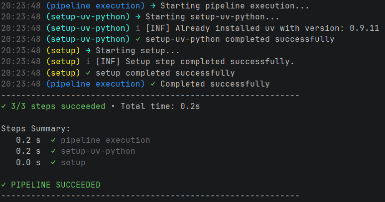
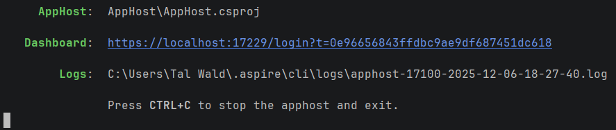
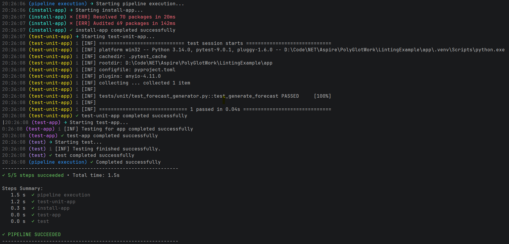
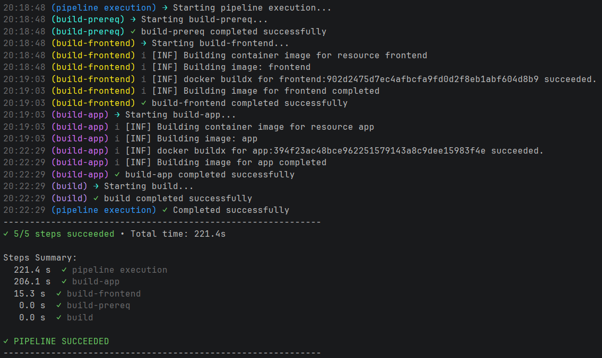

# Aspire Pipelining Vision

When working in a polyglot multi-service application, having standard way to add and run mono repo actions is critical for developer onboarding, AI agent efficiency and maintainability.

Using the Aspire pipelines you can add custom commands to run on all supported services of your application.

In this example repo, I am adding setup, install, lint and test support, but this could easily be used for more.


# Setup
```bash
aspire do setup
```



# Run:
```bash
aspire run
```



# Lint:

```bash
aspire do lint
```


# Test
```bash
aspire do test
```


# Build (Docker)
```bash
aspire do build
```


